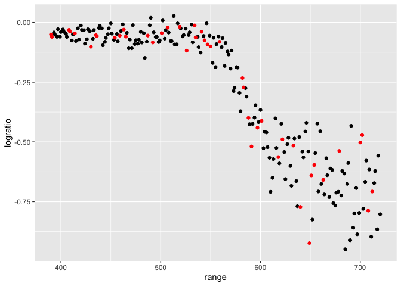
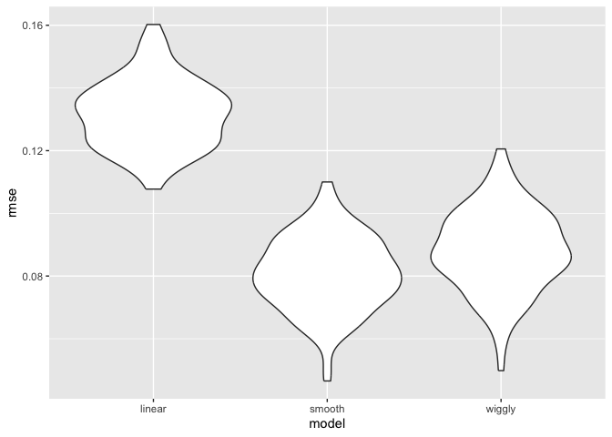
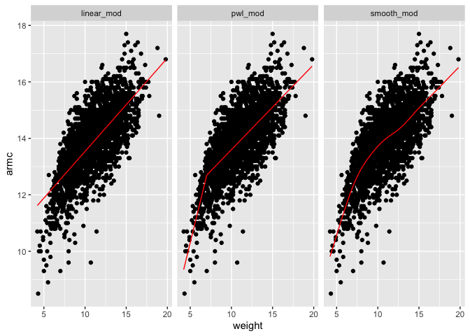
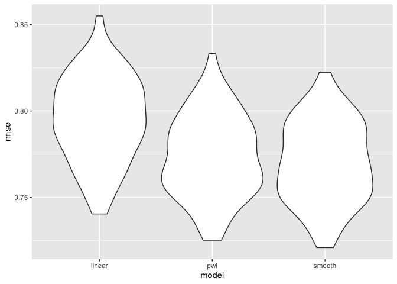

crossvalidation
================
2025-11-11

``` r
lidar
```

    ## # A tibble: 221 × 2
    ##    range logratio
    ##    <dbl>    <dbl>
    ##  1   390  -0.0504
    ##  2   391  -0.0601
    ##  3   393  -0.0419
    ##  4   394  -0.0510
    ##  5   396  -0.0599
    ##  6   397  -0.0284
    ##  7   399  -0.0596
    ##  8   400  -0.0399
    ##  9   402  -0.0294
    ## 10   403  -0.0395
    ## # ℹ 211 more rows

``` r
lidar_df <- lidar |>
  mutate(id = row_number())

lidar_df |>
  ggplot(aes(x = range, y = logratio)) +
  geom_point()
```

<!-- -->

create dataframes

``` r
train_df=
  sample_frac(lidar_df, size=.8)|>
  arrange(id)

test_df=anti_join(lidar_df, train_df,by="id")
```

``` r
ggplot(train_df, aes(x=range, y=logratio))+
         geom_point()+
  geom_point(data=test_df, color="red")
```

<!-- -->

fit a few models to `train_df`

``` r
linear_mod=lm(logratio~range, data= train_df)

smooth_mod=mgcv::gam(logratio~s(range), data=train_df)

wiggly_mod=mgcv::gam(logratio~s(range,k=30), sp=10e-6, data=train_df)
```

not the best model

``` r
train_df |>
  add_predictions(smooth_mod) |>
  ggplot(aes(x = range, y = logratio)) +
  geom_point() +
  geom_line(aes(y = pred), color = "red")
```

<!-- -->

combine three models together and compare

``` r
train_df |>
  gather_predictions(linear_mod, smooth_mod, wiggly_mod) |>
  ggplot(aes(x = range, y = logratio)) +
  geom_point() +
  geom_line(aes(y = pred), color = "red")+
  facet_grid(.~model)
```

<!-- -->

Look at prediction accuracy. try computing our RMSEs

``` r
rmse(linear_mod, test_df)
```

    ## [1] 0.142452

``` r
rmse(smooth_mod, test_df)
```

    ## [1] 0.09131071

``` r
rmse(wiggly_mod, test_df)
```

    ## [1] 0.1025655

## cross validation using `modelr` package

## iterate

``` r
cv_df=
  crossv_mc(lidar_df, n=100)|>
  mutate(
    train=map(train, as_tibble),
    test=map(test, as_tibble)
  )
```

did this work?

``` r
cv_df |>pull(train)|>nth(1)
```

    ## # A tibble: 176 × 3
    ##    range logratio    id
    ##    <dbl>    <dbl> <int>
    ##  1   390  -0.0504     1
    ##  2   391  -0.0601     2
    ##  3   393  -0.0419     3
    ##  4   394  -0.0510     4
    ##  5   396  -0.0599     5
    ##  6   399  -0.0596     7
    ##  7   400  -0.0399     8
    ##  8   402  -0.0294     9
    ##  9   403  -0.0395    10
    ## 10   406  -0.0604    12
    ## # ℹ 166 more rows

let’s fit models over and over and get rmse.

``` r
cv_df <-
  cv_df |>
  mutate(
    linear_mod = map(train, \(df) lm(logratio ~ range, data = df)),
    smooth_mod = map(train, \(df) gam(logratio ~ s(range), data = df)),
    wiggly_mod = map(train, \(df) gam(logratio ~ s(range, k = 30), sp = 10e-6, data = df))
  ) |> 
  mutate(
    rmse_linear = map2_dbl(linear_mod, test, \(mod, df) rmse(model = mod, data = df)),
    rmse_smooth = map2_dbl(smooth_mod, test, \(mod, df) rmse(model = mod, data = df)),
    rmse_wiggly = map2_dbl(wiggly_mod, test, \(mod, df) rmse(model = mod, data = df)))
```

what do these results say about model choice?

``` r
cv_df|>
  select(starts_with("rmse"))|>
  pivot_longer(
    everything(),
    names_to = "model",
    values_to = "rmse",
    names_prefix = "rmse_"
  ) |>
  mutate(model = fct_inorder(model)) |> 
  ggplot(aes(x = model, y = rmse)) + geom_violin()
```

<!-- -->

## try on a real dataset

``` r
growth_df<- read_csv("~/Desktop/data science/linearmodel/nepalese_children.csv")
```

    ## Rows: 2705 Columns: 5
    ## ── Column specification ────────────────────────────────────────────────────────
    ## Delimiter: ","
    ## dbl (5): age, sex, weight, height, armc
    ## 
    ## ℹ Use `spec()` to retrieve the full column specification for this data.
    ## ℹ Specify the column types or set `show_col_types = FALSE` to quiet this message.

weight vs arm_c

``` r
growth_df|>
  ggplot(aes(x=weight, y=armc))+
  geom_point(alpha=.3)
```

<!-- -->

show the model we can use

``` r
growth_df=
  growth_df|>
  mutate(
    weight_cp7=(weight>7)*(weight -7)
  )
```

let’s fit the models

``` r
linear_mod=lm(armc~weight, growth_df)
pwl_mod=lm(armc~weight+ weight_cp7, data=growth_df)
smooth_mod=gam(armc~s(weight), data=growth_df)
```

``` r
growth_df |>
  gather_predictions(linear_mod, pwl_mod, smooth_mod) |>
  ggplot(aes(x = weight, y = armc)) +
  geom_point() +
  geom_line(aes(y = pred), color = "red")+
  facet_grid(.~model)
```

<!-- -->

``` r
cv_df =
  crossv_mc(growth_df, 100) |> 
  mutate(
    train = map(train, as_tibble),
    test = map(test, as_tibble))

cv_df = 
  cv_df |> 
  mutate(
    linear_mod  = map(train, \(df) lm(armc ~ weight, data = df)),
    pwl_mod     = map(train, \(df) lm(armc ~ weight + weight_cp7, data = df)),
    smooth_mod  = map(train, \(df) gam(armc ~ s(weight), data = as_tibble(df)))) |> 
  mutate(
    rmse_linear = map2_dbl(linear_mod, test, \(mod, df) rmse(model = mod, data = df)),
    rmse_pwl    = map2_dbl(pwl_mod, test, \(mod, df) rmse(model = mod, data = df)),
    rmse_smooth = map2_dbl(smooth_mod, test, \(mod, df) rmse(model = mod, data = df)))

cv_df |> 
  select(starts_with("rmse")) |> 
  pivot_longer(
    everything(),
    names_to = "model", 
    values_to = "rmse",
    names_prefix = "rmse_") |> 
  mutate(model = fct_inorder(model)) |> 
  ggplot(aes(x = model, y = rmse)) + geom_violin()
```

<!-- -->
